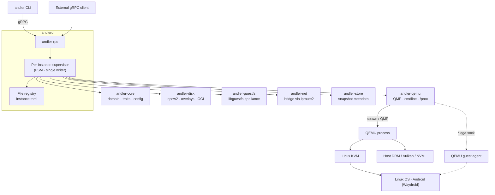

<div align="center">

<h1>ANDLER</h1>

**Android&nbsp;Linux&nbsp;Emulator&nbsp;&amp;&nbsp;Runtime**

<sub>Rust-native VM orchestration for Linux/KVM — paravirtualized 3D graphics, Android guests, external snapshot trees, live telemetry, and zero-root guest provisioning.</sub>

<br/><br/>

[![Release][badge-release]][rel]
[![GPL-3.0][badge-license]](LICENSE)
[![Linux + KVM][badge-kvm]](https://www.kernel.org/)
[![Rust stable][badge-rust]](https://www.rust-lang.org/)
[![QEMU + OVMF][badge-qemu]](https://www.qemu.org/)
[![Zero-root][badge-root]](#zero-root-guest-management)
[![gRPC][badge-grpc]](docs/GRPC_API.md)

<br/>

**[Download Release][rel]** &nbsp;•&nbsp;
**[Quick Start](#-quick-start)** &nbsp;•&nbsp;
**[CLI Reference][doc-api]** &nbsp;•&nbsp;
**[Architecture][doc-arch]** &nbsp;•&nbsp;
**[Roadmap][doc-roadmap]** &nbsp;•&nbsp;
**[FAQ](#-faq)**

<br/>

> ### Run Linux and Android VMs as *managed systems* — not as a pile of hypervisor flags.
>
> One daemon, one CLI, one declarative `instance.toml`: lifecycle and supervision over gRPC, Venus/VirGL 3D over `virtio-gpu`, live overlay snapshots with branching, base images pulled from GitHub Releases, and `/proc` + vendor GPU telemetry streamed every second.

</div>

---

## 📑 Navigation

<details open>
<summary><strong>Table of Contents</strong></summary>

- [⚡ At a Glance](#-at-a-glance)
- [📌 Project Facts](#-project-facts)
- [✦ Why ANDLER](#-why-andler)
- [⏱️ 30-Second Tour](#-30-second-tour)
- [🧱 Architecture](#-architecture)
- [📦 Installation](#-installation)
- [🚀 Quick Start](#-quick-start)
- [🎯 Capabilities](#-capabilities)
  - [3D Paravirtualized Graphics](#3d-paravirtualized-graphics)
  - [Turnkey Android Guests](#turnkey-android-guests)
  - [External Snapshot Trees](#external-snapshot-trees)
  - [Zero-Root Guest Management](#zero-root-guest-management)
  - [Operations, Hot-plug & OCI Export](#operations-hot-plug--oci-export)
- [⚙️ Configuration](#-configuration)
- [📊 Observability](#-observability)
- [🧭 CLI Cheatsheet](#-cli-cheatsheet)
- [🌦️ Environment Variables](#-environment-variables)
- [🗃️ Data Layout](#-data-layout)
- [🖥️ Host Requirements](#-host-requirements)
- [🩺 Diagnostics](#-diagnostics)
- [❓ FAQ](#-faq)
- [🧪 Testing & Verification](#-testing--verification)
- [📈 Project Metrics](#-project-metrics)
- [🤝 Contributing](#-contributing)
- [📚 Documentation](#-documentation)
- [🙏 Acknowledgments](#-acknowledgments)

</details>

---

## ⚡ At a Glance

| Layer | Technology | What you get |
| :--- | :--- | :--- |
| **Control plane** | `andlerd` daemon + gRPC + thin `andler` CLI | One entry point for lifecycle, supervision, and automation |
| **Hypervisor** | Linux KVM + QEMU + OVMF/UEFI | Hardware-isolated guests with per-instance QMP + QGA sockets |
| **3D graphics** | **Venus** (Vulkan) · **VirGL** (OpenGL) · Virtio-GPU · CPU | Near-native host GPU rendering — no dedicated card required |
| **Android layer** | Waydroid runtime on custom bootable images | Android 11 & 13 (VANILLA / GAPPS) with ARM → x86 translation |
| **Storage engine** | QCOW2 external overlay chains | Live snapshots, non-destructive branching, OCI image export |
| **State & config** | Declarative `instance.toml` per instance + SQLite snapshot metadata | Hand-edited TOML is honored; crash-safe registry scan on restart |
| **Interfaces** | Interactive wizard · flags · TOML · `--json` on every reader | Scriptable end to end, plus a terminal-native wizard for humans |
| **Security** | QGA online + `guestmount` FUSE inside unprivileged user namespaces | 100 % zero-root guest provisioning — no sudoers, no helper binary |

---

## 📌 Project Facts

| | |
| :--- | :--- |
| **Guests** | Linux (ISO install) · Android 11 & 13 (Waydroid, VANILLA / GAPPS) |
| **Host** | Linux x86_64 with KVM — `~/.andler/`, no root for normal operation |
| **Binaries** | `andlerd` (daemon) · `andler` (thin gRPC client) |
| **Protocol** | gRPC + protobuf, version handshake on every command |
| **Config** | `instance.toml` per instance — the file is the source of truth |
| **Snapshots** | External QCOW2 overlay chains: live create, offline restore, branching |
| **Metrics** | `/proc` + AMD sysfs / NVIDIA NVML / Intel `i915`-`xe`, 1 s cadence |
| **License** | GPL-3.0 · Rust, stable toolchain |

---

## ✦ Why ANDLER

Doing GPU-accelerated VMs on Linux by hand means long QEMU command lines, manual firmware paths, elevated NBD mounts, and separate monitoring scripts. **ANDLER collapses the whole stack into one declarative workflow.**

<table>
<tr>
<td width="50%" valign="top">

### 🎮 Hardware-Accelerated 3D
**Venus (Vulkan)** and **VirGL (OpenGL)** expose the host GPU to the guest over `virtio-gpu` with `blob` + `hostmem` shared memory. Desktop compositors, Vulkan apps, and Android 3D run at near-native rates.

</td>
<td width="50%" valign="top">

### 🤖 Turnkey Android Runtime
Bootable Waydroid images with a Weston/GL compositor, `GApps` variants, boot-mode switching, and transparent ARM64 translation via **libndk** or **libhoudini**.

</td>
</tr>
<tr>
<td width="50%" valign="top">

### 📸 Snapshot Trees & Branching
External QCOW2 overlay chains switched over QMP **while the guest runs**. Restore offline, branch with `--branch`, delete commits a layer into its parent — with clone-chain protection.

</td>
<td width="50%" valign="top">

### 📊 Telemetry by Default
CPU %, resident RAM, disk and network throughput from `/proc`, plus VRAM and GPU load from AMD sysfs, NVIDIA NVML, and Intel `i915`/`xe` — one stream, one-second cadence.

</td>
</tr>
</table>

---

## ⏱️ 30-Second Tour

```text
$ andler image download --android-version 13 --variant gapps     # base image from Releases
$ andler create --kind android --name pixel --android-version 13 --arm-translator libndk
$ andler start pixel                                             # boots QEMU/KVM
$ andler metrics pixel                                           # CPU · RAM · disk · net · VRAM · GPU
$ andler snapshot create pixel --tag clean-install                # live overlay snapshot
$ andler connect pixel --level console                            # serial console, ssh, or adb
$ andler export-oci pixel ./oci-out                               # OCI image layout
```

Everything above is one gRPC request per command against `andlerd`; nothing needs root, and every reader accepts `--json`.

---

## 🧱 Architecture



### Workspace map

```text
andler/
├── core/andler-core/        Domain types, HypervisorBackend trait, 9-section config, FSM
├── backends/andler-qemu/    QEMU backend: QMP + QGA, cmdline builder, /proc metrics
├── services/
│   ├── andler-disk/         qemu-img, overlays, clones, zero-root guest ops, base-image downloads
│   ├── andler-guestfs/      GuestfsMutator — libguestfs appliance, zero root
│   ├── andler-net/          Bridge networking via iproute2 (isolated: config-only)
│   ├── andler-store/        SQLite snapshot metadata + legacy config migration
│   ├── andler-firmware/     OVMF discovery, hardware auto-detect, AMD/NVIDIA/Intel GPU metrics
│   └── andler-rpc/          Protobuf definitions, gRPC, proto ↔ domain conversions
├── apps/daemon/             andlerd — supervisors, event bus, operations, health checks
├── apps/cli/                andler — wizard, diagnostics, terminal monitoring
├── docker/e2e/              Containerized unit / integration / E2E harness
├── docker/images/           Guest base-image pipelines (rootfs → bootable qcow2)
└── docs/                    Architecture, API, gRPC reference, changelog, roadmap
```

Three boundaries hold the design together: `andler-core` is the bottom layer and depends on no workspace crate; `andler-cli` talks only to `andler-rpc`; a new hypervisor means implementing `HypervisorBackend` and nothing else. Full detail in [`docs/ARCHITECTURE.md`][doc-arch].

---

## 📦 Installation

> [!IMPORTANT]
> **Prebuilt release archives are the recommended path.** Building from source is only needed to work on ANDLER itself.

Each release publishes three archives, so you install what you need and nothing else:

| Archive | Contains | For |
| :--- | :--- | :--- |
| `andler-<tag>-linux-x86_64.tar.gz` | both binaries, `LICENSE`, `README.md` | the default: a host that serves VMs and drives them |
| `andlerd-<tag>-linux-x86_64.tar.gz` | `andlerd` | a host that only serves VMs |
| `andler-cli-<tag>-linux-x86_64.tar.gz` | `andler` | a client machine, talking to a daemon elsewhere |

Every archive ships a `.sha256` sidecar, and public releases carry a build-provenance attestation.

### 1 · Install

```bash
scripts/install.sh --component both   --from-release            # latest: CLI + daemon + user service
scripts/install.sh --component daemon --from-release v0.1.0     # a pinned daemon
scripts/install.sh --component cli    --from-release v0.1.0 --no-service   # client only
```

The script verifies the published checksum, installs into `~/.local/bin` (`--bin-dir` to change it) and — for the daemon — writes and enables the per-user systemd unit. Without `--from-release` it installs a binary you already have: an explicit path, one on `PATH`, or `target/release` after `cargo build --release`.

<details>
<summary><strong>Download and install by hand</strong></summary>

```bash
tar -xzf andler-v0.1.0-linux-x86_64.tar.gz        # or andlerd-… / andler-cli-…
sudo install -m 0755 andler-v0.1.0-linux-x86_64/andler  /usr/local/bin/andler
sudo install -m 0755 andler-v0.1.0-linux-x86_64/andlerd /usr/local/bin/andlerd
```

</details>

> [!IMPORTANT]
> Install both sides from the **same release**. `andler` verifies the daemon's version before every command and refuses a daemon built from a different one — a mismatched pair fails at the first command instead of misbehaving quietly.

### 2 · Verify the host

```bash
andler --version      # andler 0.1.0
andlerd --version     # andlerd 0.1.0 — both sides must agree
andler doctor
```

`doctor` checks KVM access, QEMU binaries, OVMF firmware, `CAP_NET_ADMIN`, the zero-root offline prerequisites, daemon reachability, and the base-image cache — every failing line prints the command that fixes it.

### 3 · The daemon as a user service

`scripts/install.sh` already wrote and enabled the unit; to check or re-point it:

```bash
systemctl --user status andlerd
scripts/install.sh --component daemon --bin-dir ~/.local/bin    # (re)install the unit for that binary
```

One daemon per `ANDLER_HOME` (flock on `~/.andler/andlerd.lock`); default listen address `127.0.0.1:50051`, overridable with `ANDLERD_LISTEN_ADDR`.

<details>
<summary><strong>Build from source (contributors)</strong></summary>

```bash
cargo build --release          # → target/release/andlerd, target/release/andler
cargo build --workspace
cargo test --workspace
```

Requires `protoc` for gRPC code generation. Reproducible builds and the full test harness run in containers — see [`docker/e2e/README.md`][doc-e2e].

</details>

---

## 🚀 Quick Start

### 0 · Start the daemon

```bash
andlerd            # or: systemctl --user start andlerd
```

### 1 · Create a VM — wizard or flags

```bash
andler create                                   # interactive wizard, hardware auto-detection
andler create --kind linux --name dev \
  --iso-path ~/isos/ubuntu.iso --disk-size-gib 128 --quick
andler create --template desktop --kind linux --name work --quick
```

Preview without touching the daemon: `--dry-run` prints the resolved config and the real QEMU command line; `--verify` prints a ✓/✗ pre-flight report and exits non-zero on failure.

### 2 · Create an Android VM — base image from the release catalog

```bash
andler image list
andler image download --android-version 13 --variant gapps
andler create --kind android --name pixel --android-version 13 --arm-translator libndk
```

Every part is checksum-verified against the release manifest before anything lands in the cache; an already-cached build is reused without a request.

### 3 · Boot, watch, and snapshot

```bash
andler start dev
andler metrics dev                 # CPU · RAM · disk · net · VRAM · GPU, every second
andler logs dev --follow
andler snapshot create dev --tag clean-install
```

---

## 🎯 Capabilities

### 3D Paravirtualized Graphics

```toml
[gpu]
render_backend = "Venus"    # Venus | VirGl | VirtioGpu | Cpu
hostmem_bytes = 4294967296  # 4 GiB shared graphics memory
blob = true                 # virtio-gpu shared memory (required for Venus)
gl = true                   # expose GL contexts
```

| Backend | Protocol | Best fit |
| :--- | :--- | :--- |
| **`Venus`** | Vulkan over `virtio-gpu` | Wayland desktops, Vulkan apps, Android 3D |
| **`VirGl`** | OpenGL over `virtio-gpu` | GL compositors, classic desktops |
| **`VirtioGpu`** | 2D `virtio-gpu` | Lightweight VMs, CI nodes |
| **`Cpu`** | Software framebuffer | Headless hosts with no usable DRM node |

| Display engine | `Sdl` (low overhead, default on NVIDIA) · `Gtk` · `Spice` · `Dbus` · `None` |
| :--- | :--- |
| **Resolution** | Applied *inside* the guest: passed as QEMU `fw_cfg` on boot, and switched live on a running VM with `andler config set <id> display.resolution WxH` through the guest agent. |

### Turnkey Android Guests

```bash
andler create --kind android --name pixel --android-version 13 --arm-translator libndk --gapps
andler guest boot-mode pixel android      # or: linux
andler config set pixel display.resolution 1920x1080
```

- **Versions & variants** — Android 11 and 13, `VANILLA` or `GAPPS`, selected by `--android-version` / `--variant`.
- **ARM → x86 translation** — `libndk` (Google prebuilt) or `libhoudini` (Intel), installed offline or online with `andler guest install`.
- **Compositor** — Weston over GL/virgl, which presents on any host GPU; `venus` stays enabled for guest Vulkan apps.
- **Provenance** — each Android instance records `base_image_pin = { id, sha256 }`; a swapped or tampered backing image is refused at creation.

### External Snapshot Trees

```text
base.qcow2 ──▶ snapshot layer ──▶ active disk.qcow2
                        └──▶ branch: experimental-branch
```

| Operation | Behaviour |
| :--- | :--- |
| `snapshot create` | Live: the QEMU block graph is switched over QMP to a fresh overlay; the previous disk becomes a layer under `disk.snapshots/`. Free space is pre-checked with `statvfs`. |
| `snapshot restore` | Offline (instance stopped): discards newer layers, or `--branch` archives the current chain as a branch you can switch back to. |
| `snapshot delete` | Commits the layer into its parent and re-points children. |
| `snapshot list` | Human-readable tree, or `--json` before the subcommand. |

Linked clones protect their source chain — a restore or delete that would break a live clone is refused with `remove the clones first`.

### Zero-Root Guest Management

| Path | Mechanism | When |
| :--- | :--- | :--- |
| **Online** | `qemu-guest-agent` over the private `*.qga.sock` chardev — `guest-exec`, file writes, resolution changes | VM is `Running` |
| **Maintenance** | The daemon auto-starts a stopped VM headless, installs through QGA, then stops it again — one cancellable supervisor operation | `guest install` / `guest remove` on a stopped VM |
| **Offline** | `guestmount` (libguestfs FUSE) + `unshare --user --map-root-user --mount` + `chroot` | `--offline`, or a VM that cannot boot |

> [!TIP]
> There is no privileged helper binary and no sudoers rule anywhere in ANDLER. `andler doctor` verifies the offline prerequisites (`guestmount`, `/dev/fuse`, unprivileged user namespaces) and prints the exact sysctl or package that enables each one.

```bash
andler guest install hello dev           # online or maintenance path, chosen automatically
andler guest apply dev                   # installs what the instance's own config selects
andler guest provision manifest.toml dev # declarative write/cp/mv/rm/chmod/symlink batch
```

### Operations, Hot-plug & OCI Export

```bash
andler attach disk dev --path /data/extra.qcow2 --size 32G   # live block hot-plug
andler attach net  dev                                        # live NIC hot-plug
andler detach disk dev --path /data/extra.qcow2
andler op list --json        &&  andler op cancel <op-id>
andler snapshot restore dev --tag clean --idempotency-token deploy-42
andler export-oci dev ./oci-out --disk-format qcow2
```

- Long operations run as supervisor sub-tasks with weighted phase progress, one operation per instance, cooperative cancellation, and an in-flight **join key**: retrying with the same `--idempotency-token` joins the running operation instead of starting a duplicate.
- `export-oci` produces a spec-conformant OCI image layout (`oci-layout`, `index.json` manifest list, `config.json`, rootfs blob under `blobs/sha256/`).

---

## ⚙️ Configuration

Each instance is a directory `~/.andler/instances/<id>/` whose `instance.toml` **is** the source of truth — the daemon re-reads it on every state transition, so hand edits are honored. SQLite keeps only snapshot metadata.

```toml
name = "dev"
iso_path = "/isos/ubuntu.iso"
disk_path = "~/vm/disk.qcow2"
ovmf_vars_path = "/usr/share/OVMF/OVMF_VARS_4M.fd"
```

<details>
<summary><strong>Full reference — 9 sections + extras</strong></summary>

```toml
name = "workstation"
disk_size_gib = 256          # thin-provisioned qcow2 default
autostart = false            # start with the daemon
snapshot_timeout_secs = 30
compact_on_shutdown = false

[cpu]
cores = 8
sockets = 1
threads = 1
priority = "Normal"
affinity = [0, 1, 2, 3]      # taskset pinning + cross-instance overlap gate

[memory]
size_bytes = 17179869184     # 16 GiB
mem_lock = false             # mlock guest RAM (-overcommit mem-lock=on)
hugepages = false            # back RAM with /dev/hugepages

[gpu]
render_backend = "Venus"
hostmem_bytes = 4294967296
blob = true
gl = true

[display]
resolution = { width = 1920, height = 1080 }
display_engine = "Sdl"       # Sdl | Gtk | Spice | Dbus | None

[network]
mode = "Nat"                 # Nat | Bridge | Isolated
nat_backend = "Slirp"        # or "Passt" when available
device_model = "virtio-net-pci"

[[network.port_forwards]]
protocol = "tcp"
host_port = 2222
guest_port = 22

[audio]
backend = "Pipewire"
device = "VirtioSound"

[input]
pointer_mode = "Tablet"
hide_host_cursor = true
clipboard_enabled = true     # needs spice-vdagent inside the guest

# Android instances instead of iso_path:
# android_version = 13, base_image_path, overlay_size_gib = 128
# gapps = true, arm_translator = "libndk", boot_mode = "android"
```

</details>

| Editing surface | Behaviour |
| :--- | :--- |
| `config view` / `config edit` | Prints or opens the real `instance.toml` in `$VISUAL`/`$EDITOR`; the file is authoritative. |
| `config set <key> <value>` | Walks the full `InstanceConfig` key schema — every key is either settable or rejected with the reason it is not (e.g. `cpu.affinity` → *edit `instance.toml` directly*). |
| `config status` | File-vs-memory diff: what `instance.toml` holds versus what the daemon loaded, plus any pending live resolution. |
| `create --template` | Built-ins `headless` / `desktop`, or your own files under `~/.andler/templates/`; precedence is defaults < template < flags. |

**Guard rails enforced at start:** host-port conflicts, a disk already in use by another running instance, overlapping CPU pins, and guest RAM that would exceed host physical RAM.

---

## 📊 Observability

```bash
andler metrics dev            # stream   ·   --once   ·   --json
```

```text
cpu=14.2%    rss=2.41 GiB   disk_r=32.4 MB/s  disk_w=1.2 MB/s  net_rx=840 KB/s  net_tx=120 KB/s  vram=1.42 GiB/8.00 GiB  gpu=42%
```

| Metric | Source | Mechanism |
| :--- | :--- | :--- |
| CPU % | `/proc/<pid>/stat` | Delta of `utime + stime` over uptime and core count |
| Resident RAM | `/proc/<pid>/status` | `VmRSS` |
| Disk I/O | `/proc/<pid>/io` | `read_bytes` / `write_bytes` deltas (clamped, non-monotonic safe) |
| Network | `/proc/net/dev` | Delta throughput per interface |
| VRAM / GPU | AMD sysfs · NVIDIA NVML + `nvidia-smi` fallback · Intel `i915`/`xe` | First found vendor wins |

```bash
andler events dev --follow --json     # lifecycle, operations, QMP events
andler logs daemon --follow           # the daemon's own log from an in-memory ring
andler doctor --metrics               # RPC latency p50/p99, errors by status, running guest RAM
```

Every CLI request carries a `request_id` metadata header, so a daemon log line reconstructs the path CLI → RPC → operation. Guest output is never logged at INFO/WARN — see the redaction policy in [`docs/ARCHITECTURE.md`][doc-arch].

---

## 🧭 CLI Cheatsheet

```bash
# Lifecycle
andler create | wizard | start | stop [--graceful] | pause | resume | remove [--purge]
andler list [--state running] [--name <regex>] [--sort name] [--json] [-q]
andler status <id> [--json]

# Configuration
andler config view|edit|status <id>       &&      andler config set <id> <key> <value>

# Monitoring
andler metrics <id> [--once|--json]       &&      andler logs <id> [--follow|--grep <re>|--tail N]
andler events [<id>] [--follow|--json]    &&      andler logs daemon [--follow|--json|--since MS]

# Snapshots & operations
andler snapshot create|restore|delete <id> --tag <t> [--branch] [--idempotency-token <k>]
andler snapshot list <id>                 &&      andler op list|cancel [<id>]

# Storage
andler disk create|info|resize [--shrink]|compact <path>
andler clone <id> --name <n> --mode linked|full-standalone|shared-base
andler export <id> <dest>                 &&      andler export-oci <id> <dest> [--disk-format …]
andler attach|detach disk|net <id> [flags]

# Guest
andler connect <id> [--level auto|console|ssh|adb]   &&   andler exec <id> -- <cmd>
andler guest install|remove <pkg> <id> [--offline] [--idempotency-token <k>]
andler guest list|apply|boot-mode|provision <id|manifest>

# Host & images
andler doctor [--metrics]                 &&      andler image list|download [--android-version 13 --variant gapps]
andler cache list|clean [--dry-run|--json]        &&   andler completions <bash|zsh|fish>
```

> [!NOTE]
> `--json` is accepted by `status`, `list`, `metrics`, `config status`, `create` (including `--dry-run` and `--verify`), `clone`, `export`, `disk info`, `guest list`, `doctor`, `cache`, `image`, `exec`, `attach`/`detach`, and `op list`. On failure it emits a single `{"error": "…"}` document on stderr.

---

## 🌦️ Environment Variables

| Variable | Applies to | Purpose |
| :--- | :--- | :--- |
| `ANDLERD_LISTEN_ADDR` | daemon | Listen address (default `127.0.0.1:50051`) |
| `ANDLERD_STORE_PATH` | daemon | SQLite path (default `~/.andler/andlerd.db`) |
| `ANDLERD_OVMF_CODE` / `ANDLERD_OVMF_VARS` | daemon | Override the discovered OVMF pair |
| `ANDLERD_LOG_FORMAT=json` | daemon | Structured JSON logging (tee'd into the daemon log ring) |
| `ANDLERD_HEALTH_CHECK_INTERVAL_SECS` | daemon | Health-check interval (default `30`, `0` disables) |
| `ANDLERD_GUEST_AGENT_WAIT_SECS` | daemon | How long a maintenance auto-start waits for QGA (default `120`) |
| `ANDLERD_GUEST_PACKAGE_TIMEOUT_SECS` | daemon | How long one in-guest package-manager step (index refresh, install, remove) may run (default `600`, minimum `30`) — raise it when a guest's mirrors are slow |
| `ANDLERD_DEV_RESTART=1` | daemon | SIGTERM/Ctrl+C leaves VMs running; the next start adopts them |
| `ANDLERD_IMAGE_REPO` | daemon | `owner/repo` whose releases hold the base images (default `hateoff0/andler`) |
| `ANDLERD_IMAGE_API_BASE` | daemon | API base for the release catalog (default `https://api.github.com`) |
| `ANDLERD_IMAGE_TOKEN` | daemon | Token for a private catalog; falls back to `GH_TOKEN` / `GITHUB_TOKEN` |
| `ANDLERD_ADDR` | CLI | Daemon address; `--daemon-addr` overrides (needs a scheme: `http://…`) |
| `ANDLER_HOME` | both | Root of all ANDLER data (default `~/.andler`) |
| `ANDLER_WIZARD_NOT_TTY` | CLI | Test override: force the non-interactive wizard path |
| `RUST_LOG` | daemon | `tracing` filter, overrides `-v` / `-vv` |

---

## 🗃️ Data Layout

```text
~/.andler/
├── andlerd.db                   SQLite: snapshot metadata only
├── andlerd.lock                 flock — one daemon per ANDLER_HOME
├── instances/<64-hex-id>/
│   ├── instance.toml            Single source of truth for config
│   ├── events.jsonl             Registry audit log (transitions, operations)
│   ├── disk.qcow2               Active writable volume
│   ├── disk.snapshots/          External immutable overlay layers
│   ├── VARS.fd                  Per-instance UEFI NVRAM copy
│   ├── console.log              Serial console transcript
│   └── qemu.log                 QEMU stdout/stderr history
├── cache/
│   ├── base-images/             <stem>.qcow2 + <stem>.manifest.json (flat or androidN-variant/)
│   └── arm-translators/         libndk / libhoudini prebuilts
└── templates/                   User VM templates (headless/desktop built-ins are shipped)

$XDG_RUNTIME_DIR/andler/qmp/
├── <id>.sock                    QMP command monitor
├── <id>.sock.events.sock        Dedicated QMP event monitor
└── <id>.qga.sock                Guest-agent chardev
```

Instance IDs are 64-hex; commands accept Docker-style prefixes, and `list` shows the first 12 characters (`-q` / `--full-id` for the whole id).

---

## 🖥️ Host Requirements

| Requirement | Needed for | Notes |
| :--- | :--- | :--- |
| Linux with KVM (`/dev/kvm`, user in `kvm`) | every VM | mandatory; without it QEMU falls back to unusable software emulation |
| `qemu-system-x86_64` + `qemu-img` | spawn, disk ops | OVMF/UEFI boot support required |
| OVMF/UEFI firmware pair | guest boot | auto-discovered across distro layouts; override with `ANDLERD_OVMF_CODE` / `ANDLERD_OVMF_VARS` |
| `guestmount` + `/dev/fuse` + unprivileged user namespaces | offline guest operations | the online QGA path needs none of this |
| `oras` | OCI image export/import | optional; `doctor` warns when missing |
| `CAP_NET_ADMIN` on `andlerd` | bridge networking | `Nat` mode works without it |
| `protoc` | building from source | contributors only |

Full prerequisite list with per-distro commands: [`docs/DEVELOPMENT.md`][doc-dev].

---

## 🩺 Diagnostics

```bash
andler doctor            # read-only; works even with the daemon down
andler doctor --json     # {"overall": "ok" | "needs_attention", "checks": [...]}
```

```text
andler doctor

Hypervisor
  ✓ /dev/kvm: accessible
  ✓ qemu-system-x86_64: /usr/bin/qemu-system-x86_64
  ✓ qemu-img: /usr/bin/qemu-img
  ✓ OVMF/UEFI firmware: /usr/share/OVMF/OVMF_CODE_4M.fd + /usr/share/OVMF/OVMF_VARS_4M.fd
  ⚠ CAP_NET_ADMIN: not held — bridge networking will fail
      → setcap on andlerd, or use network mode = "Nat"

Offline guest operations (guestmount + userns)
  ✓ oras: /usr/bin/oras
  ✓ guestmount (FUSE): /usr/bin/guestmount
  ✓ /dev/fuse: accessible
  ⚠ unprivileged user namespaces: disabled
      → sudo sysctl kernel.unprivileged_userns_clone=1

Daemon
  ✓ andlerd: reachable at http://127.0.0.1:50051
Base images
  ✓ 4 build(s) cached in ~/.andler/cache/base-images (12.4 GiB)
```

| Symptom | Fix |
| :--- | :--- |
| `andlerd is not running` | The address needs a scheme — `--daemon-addr http://127.0.0.1:50051`, not a bare host:port. |
| `/dev/kvm` present but denied | `sudo usermod -aG kvm $USER`, then re-login. |
| Instance stuck in `Error` | `andler status <id>` records why (health check, backend loss, refused start); `andler start <id>` retries from `Error`. |
| A failed start, reason unclear | Tail `~/.andler/instances/<id>/qemu.log` and `console.log` — `andler logs <id>` streams the same. |
| Offline `guest install` fails | `andler doctor` shows the missing prerequisite; retry with `--offline` only for a VM that cannot boot. |
| Two daemons | One daemon per `ANDLER_HOME`; point `ANDLER_HOME` elsewhere for a test run. |

---

## ❓ FAQ

<details>
<summary><strong>Do I need a second GPU?</strong></summary>

No. Venus (Vulkan) and VirGL (OpenGL) share your existing host GPU over `virtio-gpu`; that is the supported 3D path. VFIO passthrough is reserved in the domain model but not implemented, and no physical card dedication is required for acceleration.

</details>

<details>
<summary><strong>Is root required?</strong></summary>

No. The daemon runs as your user and performs no privileged operations: online guest work goes over the guest agent, offline work through `guestmount` plus an unprivileged user namespace. Bridge networking is the one feature that additionally wants `CAP_NET_ADMIN` on `andlerd`; `Nat` mode needs nothing.

</details>

<details>
<summary><strong>Does it work on NVIDIA hosts?</strong></summary>

Yes. The Android session composites through Weston over GL rather than a Vulkan-only compositor, so frames present on any host GPU; `Sdl` is the default display engine when an NVIDIA GPU is detected.

</details>

<details>
<summary><strong>Can I run everything headless?</strong></summary>

Yes — set `display.display_engine = "None"`, or create from the built-in `headless` template. Metrics, logs, events, `exec`, and the guest agent all work with no display attached.

</details>

<details>
<summary><strong>Where do base images come from?</strong></summary>

The project publishes bootable Android images to GitHub Releases; `andler image list` / `image download` verify every part against the release manifest and install them into the cache. You can also build one locally with the pipeline in `docker/images/`.

</details>

<details>
<summary><strong>Can snapshots be taken on a running VM?</strong></summary>

Creating is live (the block graph is switched over QMP). Restoring and deleting are offline by design: they rewrite the chain, so the instance must be stopped. `--branch` restores without discarding the current chain.

</details>

<details>
<summary><strong>Windows or macOS guests?</strong></summary>

Not supported. ANDLER targets Linux and Android guests on x86_64 with KVM.

</details>

<details>
<summary><strong>Why was my <code>start</code> refused?</strong></summary>

Start-time gates refuse a VM before QEMU is touched: a host port already bound, a disk already in use by another running instance, a CPU pin overlapping another running VM, or guest RAM that would exceed host physical memory. The error names the conflicting instance and what to do.

</details>

---

## 🧪 Testing & Verification

| Tier | Command | Needs KVM |
| :--- | :--- | :--- |
| Unit | `cargo test --workspace` | No |
| Integration | `cargo test --workspace -- --ignored` | Yes |
| gRPC round-trip | `cargo test -p daemon grpc_roundtrip` | No |
| E2E | `docker compose -f docker/e2e/compose.yaml run --rm e2e` | Yes |

The E2E orchestrator starts a fresh daemon and store per suite under a wall-clock watchdog and runs every suite in `docker/e2e/tests/NN_*.sh` — lifecycle and FSM negatives, config, disk, external snapshots and chain reconciliation, clone/export, hot-plug, guest operations online and offline, preview/verify, persistence and adoption, operations, connect/exec, port forwards, boot mode, version handshake, events, daemon logs and metrics, autostart, the start-time conflict gates, affinity/mem-lock/hugepages, `--json` output, OCI export, and base-image downloads against a fixture release server.

Before any change lands: `cargo build --workspace` → `cargo test --workspace` → `cargo clippy --workspace -- -D warnings` → `cargo fmt --all -- --check`.

---

## 📈 Project Metrics

<div align="center">

<a href="https://github.com/hateoff0/andler">
  
  
</a>
<a href="https://github.com/hateoff0/andler">
  
  
</a>

<br/><br/>


<br/>

<sub>Cards by <a href="https://github.com/stats-organization/github-stats-extended">github-stats-extended</a> · badges by <a href="https://shields.io/">Shields.io</a></sub>

</div>

> [!NOTE]
> The cards and badges resolve once this repository is public; each card follows the reader's colour scheme (dark/light).

---

## 🤝 Contributing

1. Read [`docs/DEVELOPMENT.md`][doc-dev] and the README of the crate you are touching.
2. Branch from `main`; every commit keeps the gate green — a branch is not a WIP dump.
3. Conventional Commits — `feat(qemu): …`, `fix(disk): …`, `docs(cli): …` — one logical change per commit.
4. Run the full gate, then re-run it after any later edit:

```bash
cargo build --workspace
cargo test --workspace
cargo clippy --workspace -- -D warnings
cargo fmt --all -- --check
```

User-visible behavior also needs an E2E suite that exercises its **positive** path, and the owning doc updated in the same commit.

---

## 📚 Documentation

| Document | Owns |
| :--- | :--- |
| [`docs/ARCHITECTURE.md`][doc-arch] | Architecture, crate responsibilities, FSM, snapshot mechanism, redaction policy |
| [`docs/API.md`][doc-api] | CLI reference with every flag, TOML config format |
| [`docs/GRPC_API.md`][doc-grpc] | Proto messages, RPC list, gRPC status-code table |
| [`docs/DEVELOPMENT.md`][doc-dev] | Development workflow, crate layout, adding a config field or RPC |
| [`docs/CHANGELOG.md`][doc-changelog] | User-visible changes |
| [`docs/ROADMAP.md`][doc-roadmap] | Now / next / later plans |
| [`docker/e2e/README.md`][doc-e2e] | Containerized build, test and E2E targets |
| Crate `README.md` files | Crate-local behavior — e.g. QEMU wire schemas in `backends/andler-qemu/README.md` |

---

## 🙏 Acknowledgments

ANDLER is mostly glue around excellent work by other people. Every link below is the source of truth for the component it names.

<table>
<tr>
<td width="50%" valign="top">

### 🧩 Hypervisor & kernel
- [QEMU](https://www.qemu.org/) — machine emulation; `qemu-img` drives every disk operation
- [Linux KVM](https://www.kvm.org/) — the hardware virtualization ANDLER targets
- [virtio](https://docs.oasis-open.org/virtio/) — paravirtualized devices (blk, net, gpu, serial, sound)
- [OVMF / edk2](https://github.com/tianocore/edk2) — UEFI firmware for guest boot
- [libguestfs](https://libguestfs.org/) — `guestmount` and the appliance behind zero-root offline guest work

### 🎮 Paravirtualized graphics
- [Mesa Venus](https://docs.mesa3d.org/drivers/venus.html) — Vulkan over `virtio-gpu`
- [VirGL](https://docs.mesa3d.org/drivers/virgl.html) — OpenGL over `virtio-gpu`
- [ANGLE](https://chromium.googlesource.com/angle/angle/) — GL on Vulkan inside modern Android stacks

</td>
<td width="50%" valign="top">

### 🤖 Android & Waydroid
- [Waydroid](https://github.com/waydroid/waydroid) — the Android-in-container runtime ANDLER boots
- [waydroid-nvidia](https://github.com/Shiro836/waydroid-nvidia) — GPU-accelerated Waydroid on the NVIDIA driver, container-native and **without VFIO passthrough**: Vulkan (Venus) is proxied over a unix socket to a host renderer, and buffers reach the compositor as native NVIDIA dmabufs. The reference for making Android 3D work on NVIDIA hardware.
- [waydroid_script](https://github.com/casualsnek/waydroid_script) — reference for translator pins, `build.prop` keys and binfmt registration
- [waydroid-helper](https://github.com/waydroid-helper/waydroid-helper) — reference packaging for `libndk` / `libhoudini`
- [libndk_translation prebuilt](https://github.com/supremegamers/vendor_google_proprietary_ndk_translation-prebuilt) · [libhoudini prebuilt](https://github.com/supremegamers/vendor_intel_proprietary_houdini) — ARM → x86 translation runtimes ANDLER installs
- [binfmt_misc](https://docs.kernel.org/admin-guide/binfmt-misc.html) — how the kernel hands ARM ELF binaries to those runtimes

### 🏛️ Architecture & design references
- [containerd](https://github.com/containerd/containerd) — gRPC daemon shape: plugin services, snapshots, event streaming, thin client
- [Proxmox VE](https://github.com/proxmox/proxmox-rs) — typed parameter validation and error → status mapping
- [quickemu](https://github.com/quickemu-project/quickemu) — host-capability-driven QEMU command-line building

</td>
</tr>
</table>

**README craft** — [awesome-readme](https://github.com/matiassingers/awesome-readme) · [Best-README-Template](https://github.com/othneildrew/Best-README-Template) · [readme-md-generator](https://github.com/kefranabg/readme-md-generator)

**Rust ecosystem** — [tokio](https://github.com/tokio-rs/tokio) · [tonic](https://github.com/hyperium/tonic) · [prost](https://github.com/tokio-rs/prost) · [clap](https://github.com/clap-rs/clap) · [serde](https://github.com/serde-rs/serde) · [tracing](https://github.com/tokio-rs/tracing) · [thiserror](https://github.com/dtolnay/thiserror) · [rusqlite](https://github.com/rusqlite/rusqlite) · [nvml-wrapper](https://github.com/Cldfire/nvml-wrapper)

---

## 📄 License

ANDLER is licensed under the **GNU General Public License v3.0** — see [`LICENSE`](LICENSE).

<div align="center">

<br/>

<sub>[Releases][rel] · [Issues](https://github.com/hateoff0/andler/issues) · [Discussions](https://github.com/hateoff0/andler/discussions) · [CHANGELOG][doc-changelog] · [ROADMAP][doc-roadmap] · [Back to top](#-navigation)</sub>

<sub>GPL-3.0 © the ANDLER contributors</sub>

</div>

[rel]: https://github.com/hateoff0/andler/releases/latest
[doc-arch]: docs/ARCHITECTURE.md
[doc-api]: docs/API.md
[doc-grpc]: docs/GRPC_API.md
[doc-dev]: docs/DEVELOPMENT.md
[doc-changelog]: docs/CHANGELOG.md
[doc-roadmap]: docs/ROADMAP.md
[doc-e2e]: docker/e2e/README.md
[badge-release]: https://img.shields.io/github/v/release/hateoff0/andler?style=for-the-badge&color=6366f1&logo=github&logoColor=white
[badge-license]: https://img.shields.io/badge/GPL--3.0-a855f7?style=for-the-badge
[badge-kvm]: https://img.shields.io/badge/Linux-KVM-22c55e?style=for-the-badge&logo=linux&logoColor=white
[badge-rust]: https://img.shields.io/badge/Rust-stable-ea580c?style=for-the-badge&logo=rust&logoColor=white
[badge-qemu]: https://img.shields.io/badge/QEMU-OVMF-0284c7?style=for-the-badge
[badge-root]: https://img.shields.io/badge/zero--root-no_sudoers-111827?style=for-the-badge&logo=lock&logoColor=white
[badge-grpc]: https://img.shields.io/badge/gRPC-protobuf-2f6b4f?style=for-the-badge
